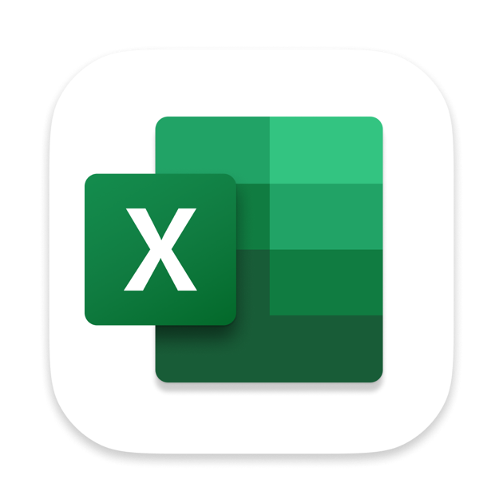

## Hi there 👋

  

  
## Who am I?

Mi name is Juan Pablo Fernández. I´m a 22-years-old data enthusiast from Argentina, dedicated to the world of Data Science. 

## What do I do?

I'm currently working on projects focused on data extraction, analysis, and processing to strengthen my skills in this field. Every dataset is an opportunity to learn and grow. 

## Where am I heading?

My main goal is to translate numbers into accessible and meaningful insights for everyone. I genuinely enjoy this process and hope to turn it into a career. Right now, I believe this is what I want to do for the rest of my life. 

## Tech Stack

  
  
  
  
   

Thanks to the Henry Bootcamp and several independent courses, I've developed strong skills in:   
• Microsoft Excel/Spreadsheets   
• SQL   
• Python   
• PowerBI   
• Tableau   

## Feel free to reach out!
## Always open to new projects and challenges🚀

Mail: juanpablofernandez132@gmail.com  
Notion: https://www.notion.so/dc9c6d22f2ef4a86a177afb95869361c
